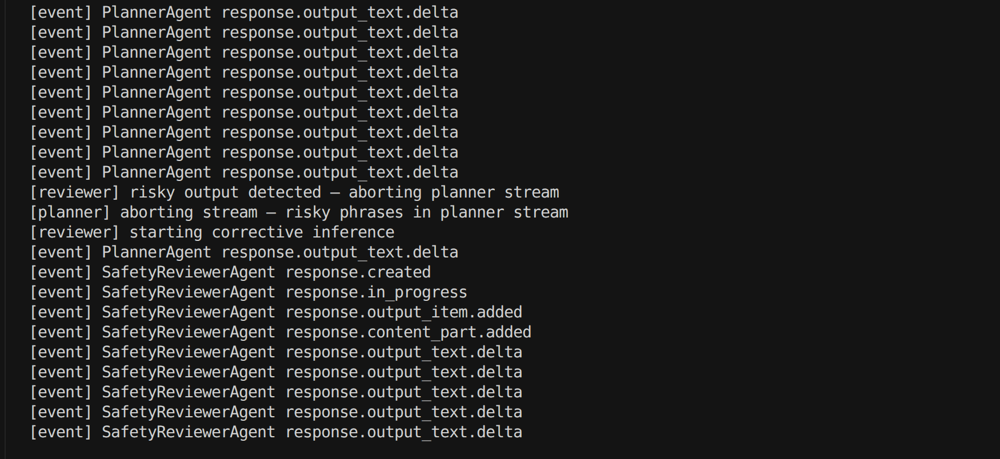

# Inference Interception

Demonstrates **non-blocking, event-driven agents** in a shared `AgenticEnvironment`:

- **PlannerAgent** — runs streaming inference on a user migration prompt
- **SafetyReviewerAgent** — watches the planner’s `SemanticEvent` stream, aborts the planner via `AbortSignal` when risky phrases appear, then starts corrective inference
- **RuntimeObserver** — logs stream events and completed model messages for debugging

Requires `@mozaik-ai/core` **3.10+** (`BaseAgent`, `BaseObserver`, `SemanticEvent`).

## Example output



When you run the example, the planner streams `[event]` deltas until the safety reviewer detects risky phrases, aborts the planner stream, and starts corrective inference.

## Run

From the repository root (with `OPENAI_API_KEY` in `.env`):

```bash
npm run inference-interception
```

Or:

```bash
npx tsx inference-interception/index.ts
```

Watch the console for `[event]` lines (streaming deltas), `[planner] aborting stream` / `[reviewer] risky output detected` when risky phrases appear, then corrective inference. The planner passes an `AbortController` signal into `runInference`; `OpenAIInferenceRunner` stops yielding stream events once aborted.

With streaming, text lives on `event.data.delta` for `response.output_text.delta` events (not `String(event.data)`).

## Layout

| File | Role |
|------|------|
| `index.ts` | Wires environment, models, participants, and the initial prompt |
| `planner-agent.ts` | Primary agent; non-blocking `runInference` |
| `safety-reviewer-agent.ts` | Intercepts planner stream via `onExternalEvent` |
| `runtime-observer.ts` | Passive logging observer |
